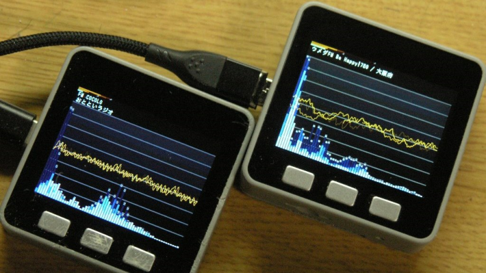
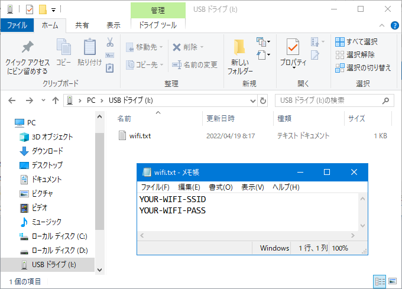

# WebRadio_Japan

### 機能
- [WebRadio_with_ESP8266Audio](https://github.com/m5stack/M5Unified/tree/master/examples/Advanced/WebRadio_with_ESP8266Audio) をベースにして、[JCBAインターネットサイマルラジオ](https://www.jcbasimul.com/) と [radiko(ラジコ)](https://radiko.jp/) を聴けるようにしました。
- 選局と音量は不揮発性メモリに保存され、次回の起動時に初期採用されます。
- [リリースパッケージ](release/) も用意しました。Arduino 環境のない方でもインストールできます。

### WiFi設定
SDカードを用いて WiFi の設定が行えます。  
いったん接続に成功すれば、以降はSDカードは必要ありません。  
具体的な記述方法は [説明](sdcard/) をご覧ください。

### ビルドに必要なライブラリ
#### Jcbasimul / Radiko 共通
- [espressif/arduino-esp32](https://github.com/espressif/arduino-esp32)
- [m5stack/M5GFX](https://github.com/m5stack/M5GFX)
- [m5stack/M5Unified](https://github.com/m5stack/M5Unified)
- [wakwak-koba/ESP8266Audio](https://github.com/wakwak-koba/ESP8266Audio) forked from [earlephilhower/ESP8266Audio](https://github.com/earlephilhower/ESP8266Audio)
#### Jcbasimul のみ
- [Links2004/arduinoWebSockets](https://github.com/Links2004/arduinoWebSockets)
- [arduino-libraries/Arduino_JSON](https://github.com/arduino-libraries/Arduino_JSON)

### ビルド時の注意
- Jcbasimal のほうは arduino-esp32 v2.0.4 では動きません。v2.0.3／v2.0.3 をお使いください。
- Radiko のほうは arduino-esp32 v2.0.4 で動作します。
- arduino-esp32 v2.0.3 では PSRAM 有効にするとビルドが失敗します。v2.0.2 をお使いください。
- M5Stack Fire で PSRAM 有効にしたとき、arduino-esp32 v2.0.4 で SPI 関係のエラーが出てしまう場合があります。その場合は v2.0.2 をお使いください。  

|ライブラリ|PSRAM無効|PSRAM有効・Fire|PSRAM有効・Fire以外|
|:--------:|:--------------------:|:--------------------:|:--------------------:|
|Jcbasimul|v2.0.2/v2.0.3|v2.0.2|v2.0.2|
|Radiko|v2.0.2/v2.0.3/v2.0.4|v2.0.2|v2.0.2/v2.0.4|

### ESP8266Audio ライブラリを Fork しました
#### SBR を無効にしました
 ESP8266Audio の AACDecorder を ESP32 で利用すると、必ず SBR が有効になってしまいますが、SBR を有効にすると Radiko の受信には最大で4チャネル必要で、メモリー不足により安定して動作しませんでした。  
 元来は「HELIX_FEATURE_AUDIO_CODEC_AAC_SBR」という定数定義に基づいて SBR が有効になるべきだと思われるものの、ESP8266 以外で常に SBR が有効になる記述も別にあり、実質的には「HELIX_FEATURE_AUDIO_CODEC_AAC_SBR」が機能しない状態になってしまっています。  
 私としてはバグだと解釈しているのですが、AAC に関する知識も欠如しており Pull-Request を提出すべきか悩んでおり、とりあえず Fork したうえで該当箇所を修正しましたので、ビルドされる方は私が Fork したほうをご利用ください。
#### PSRAM を用いないようにしました
 デコード処理に用いられる作業領域に PSRAM からの領域が割り当てられると音質が大きく劣化するため、ESP32 において常に内蔵の SRAM から確保するようにしました。

### Radiko premium（プレミアム会員）
WiFi設定と同じ要領で SDカードを用いて Radiko premium の認証情報を登録すると、全国の放送局が選局可能になります。  
ファイル名は radiko.txt で、1行目にユーザーID（メールアドレス）、2行目にパスワードを指定してください。  
いったん登録して起動させれば、認証情報は不揮発性メモリーに保存され、以降はSDカードは必要ありません。  

## examples/graphical の説明
### 設定の初期化
Aボタン・Bボタン・Cボタンの3つを押しながら電源ON（もしくはリセット）すると以下の情報が初期化されます。
- 選局
- 音量
- Radiko premiun の認証情報

### 操作方法
|ボタン|動作|
|:-------------:|:----:|
|Aボタン1回クリック|選局・次|
|Aボタン2回クリック|選局・前|
|Bボタン|音量・減|
|Cボタン|音量・増|

### 謝辞
examples/graphical に収録の、かっこいいビジュアルは [lovyan03](https://github.com/lovyan03/) さんの制作です。  
ずっと見てても飽きないです！
